# IT-Company-Task-Manager

## Description

 The IT Company Task Manager is designed to streamline and manage all tasks throughout the product development lifecycle within your team. The application allows every team member to create, update, and delete tasks. Additionally, users can assign tasks to other team members, set deadlines, and mark tasks as completed, ensuring efficient project management and collaboration.

## Deployment

Information about deployment.

You can view the deployed project [here](#).

## Test user:

- login: admin
- password: admin1234

## Installation

Python3 must be already installated

```shell
git clone https://github.com/taras-tkachuk/IT-Company-Task-Manager.git
cd IT-Company-Task-Manager
python3 -m venv venv
source venv/bin/activate (on macOS)
venv\Scripts\activate (on Windows)
pip install -r requirements.txt
python manage.py runserver
```

## Demo

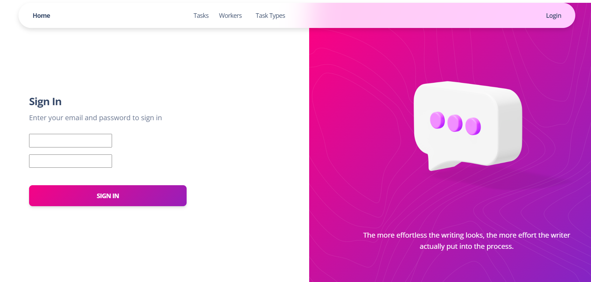
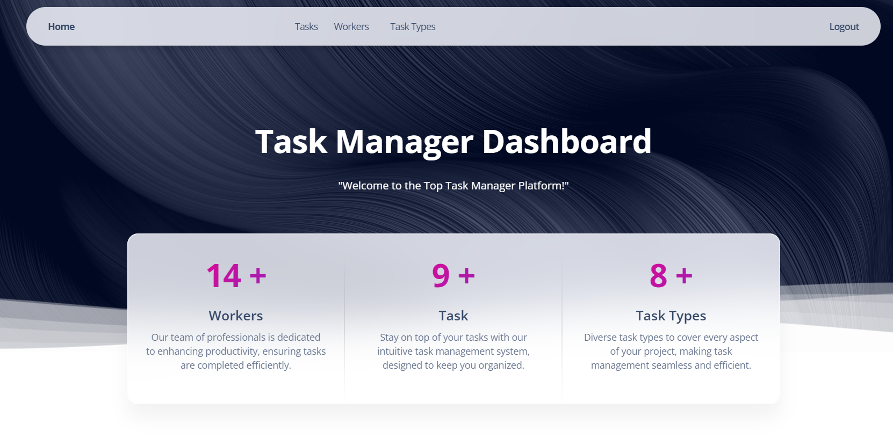
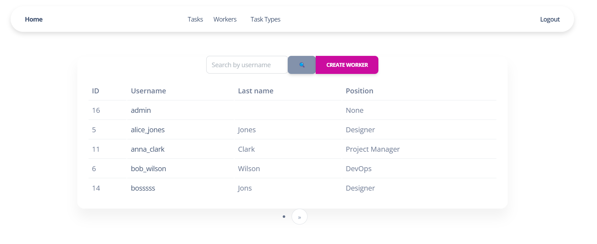
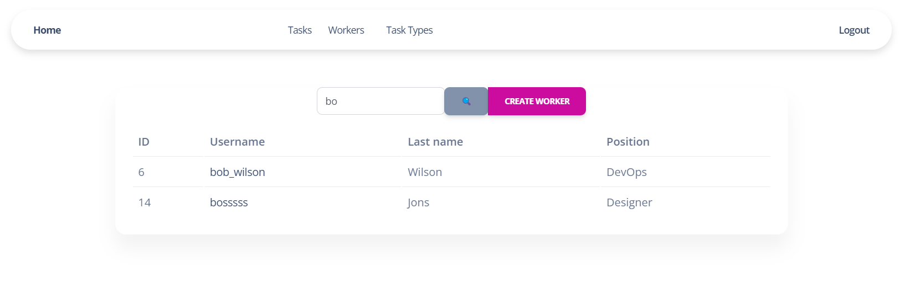
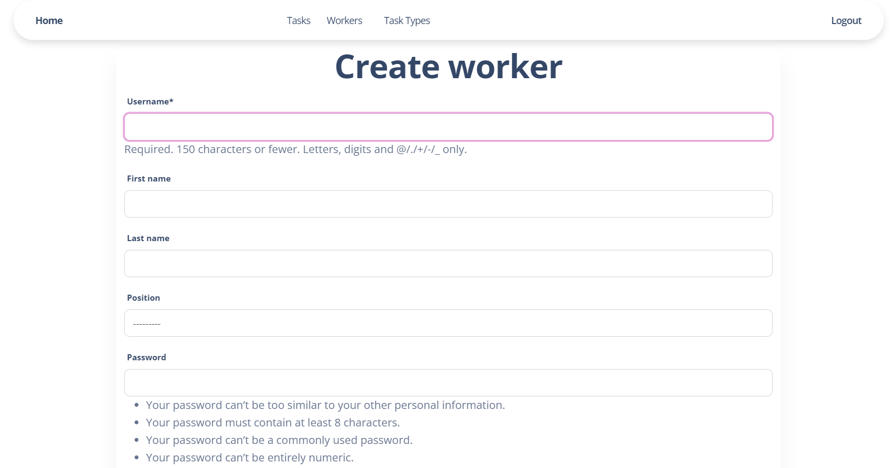
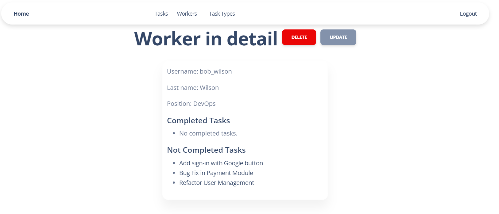
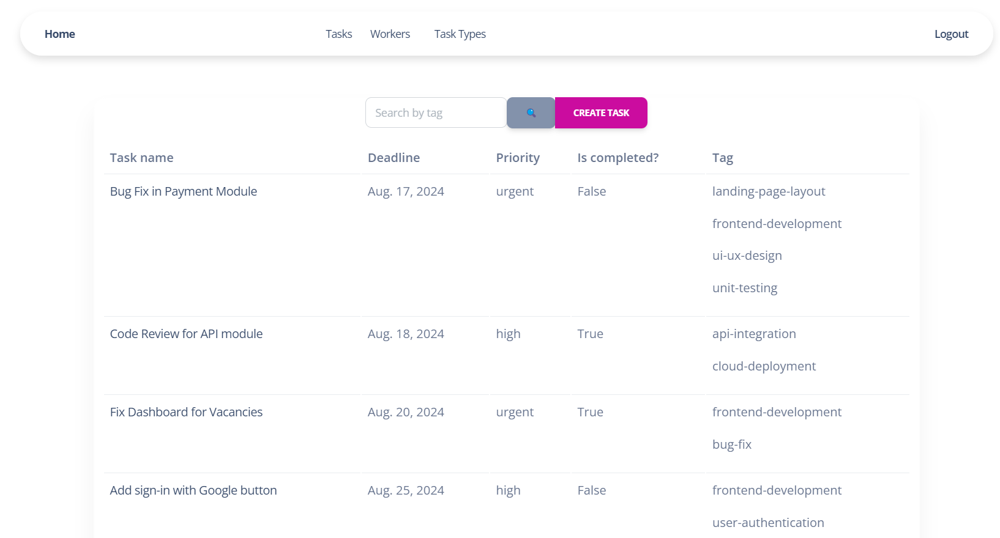
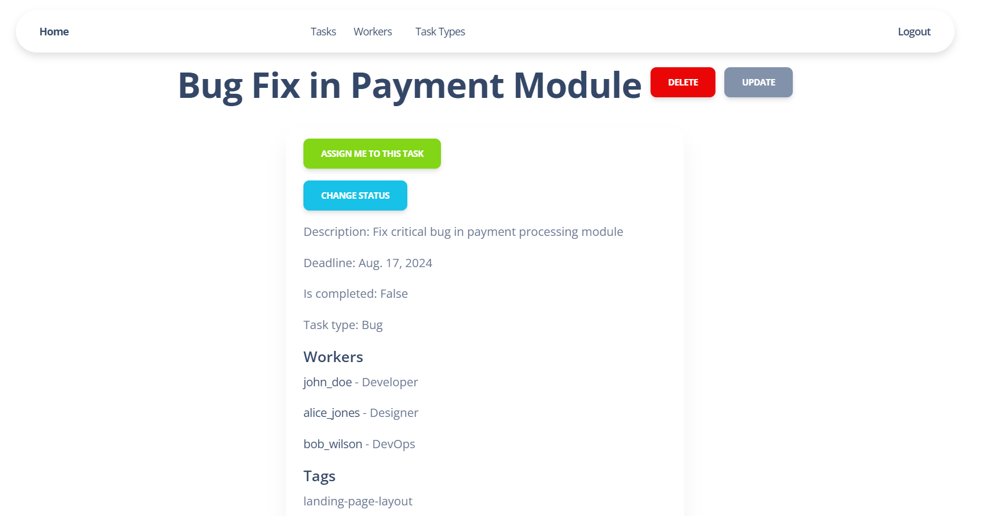
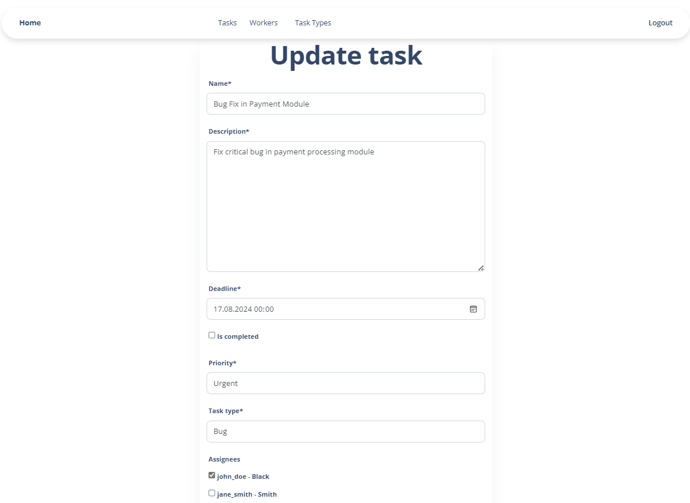
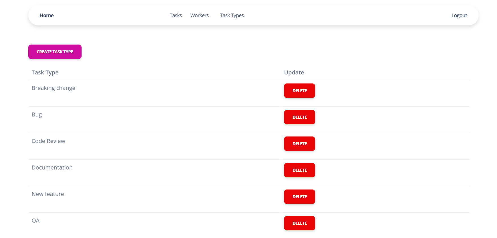
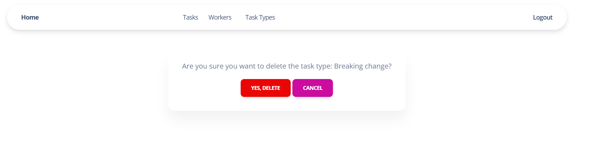
